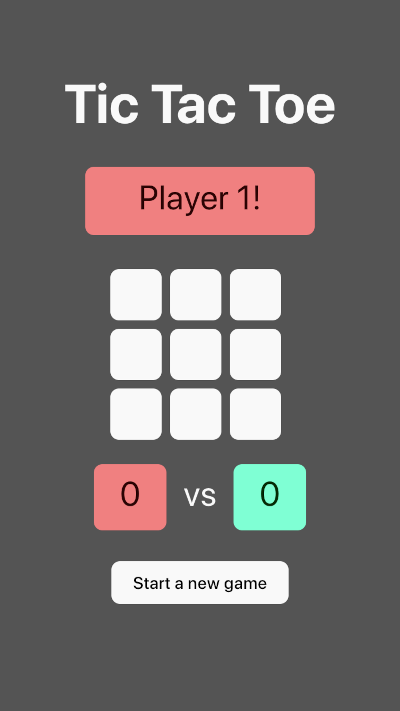

# Tic Tac Toe
Setting up a game of Tic Tac Toe using the [Vite](https://vitejs.dev/) development tooling.

## Play the game
To [play this game](https://ebabel-eu.github.io/tic-tac-toe-vite/) is 100% free, and so is the source code.

## Install
To run the code from source, install its dependencies with `npm i`

## Start locally for dev
`npm start`

## Unit tests
To execute the unit tests, run `npm test`, and to see the test coverage, run `npm run coverage`

## todo:
- [ ] more unit tests with Vitest (compatible with Jest syntax).
- [ ] end to end tests.
- [ ] add storybook.
